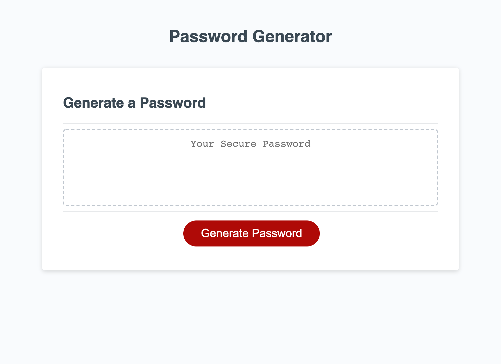

# PasswordGenerator

## Description

This page will generate a password for the user. 
It will prompt for the following options:
1. Number of characters between 8 and 128
2. Include uppercase letters
3. Include lowercase letters
4. Include numbers
5. Include special characters ?<>!@#$%^&*()

It also includes logic to deal with incorrect responses as well as the user canceling out during the prompts.

## Link to Application

https://travis-springer.github.io/PasswordGenerator/

## Screenshot

